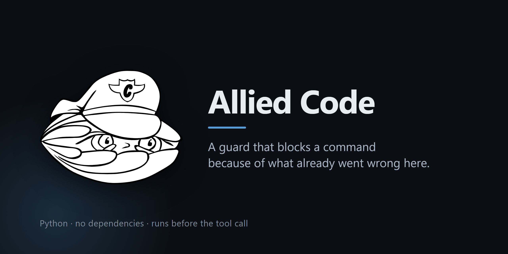

# Allied Code

A pre-execution guard for coding agents that decides from **recorded incidents**,
not from a static blocklist. The package and the CLI are named `guard`; the
project is Allied Code.

Every guard project starts the same way: a list of dangerous patterns and a
regex. The list is written once, by someone guessing, and it never learns
anything from the machine it runs on. `ops-guard` inverts that. The patterns only
say *what kind of action this is*. What decides is a corpus of incidents that
actually happened, retrieved by similarity to the action about to run and quoted
back in the reason.

So a block does not read:

```
Blocked: matched pattern rm -rf
```

It reads:

```
ops-guard: blocked — recursive, forced delete of a directory tree
[fs.recursive-delete] | precedent delegated-agent-deleted-tooling (2026-06-20):
A delegated agent never runs a destructive command. Deletion is done by the
orchestrator, one item at a time, with explicit approval for each.
```

The second one is arguable. That is the point: you can open the incident, decide
the guard is wrong, and change the corpus instead of disabling the guard.

## What it does

- **Classifies** a proposed tool call into hazard classes (recursive delete,
  history rewrite, credential exposure, outward publish, system configuration,
  pipe-from-network-to-shell, and so on).
- **Retrieves** the incidents that resemble it, from a folder of plain markdown
  files you own and can edit.
- **Decides** `deny` / `ask` / `defer`, with the precedent named in the reason.
- **Writes a receipt** for every decision — including the ones where it stayed
  quiet — with the redacted action, the classes, the evidence, and the latency.
- **Briefs** an agent or a person *before* the work starts, from the same corpus:
  `guard brief "clean up old branches"` returns what already went wrong here.

## What it deliberately does not do

- It does not grant permission. By default the guard never returns `allow`; it
  can raise friction, never lower it. `allow_safe` exists, is off, and should
  stay off unless you know exactly what you are trading.
- It does not call a model, or the network, or a vector database. It runs in
  front of every tool call, so it has a millisecond budget and no right to spend
  yours. Retrieval is lexical and dependency-free (~0.1 ms when nothing matches,
  ~4 ms with retrieval, measured on a low-end laptop).
- It does not replace your runtime's permission system. It feeds it.

## Install

Requires Python 3.11+. No dependencies.

```bash
pipx install git+https://github.com/Abner-Machado/allied-code
guard install --write     # merges the hooks into your agent settings
guard doctor              # confirms it is actually on
```

`install --write` backs the settings file up with a timestamp before touching it,
merges instead of replacing, and is idempotent. Without `--write` it prints the
block for you to paste. That care is not generic caution: `corpus/` already holds
the incident where editing a global config to install tooling broke the tooling
that was working.

`guard doctor` answers the only question that matters after installing — is it on?
It checks the interpreter, the corpus, a writable ledger, live classification, and
whether the hook is actually wired, and exits non-zero if any of that fails.

To work from a checkout instead, `git clone`, then
`python -m guard.cli install --python /path/to/python`.

### The three layers

The corpus is the same in all three places; what differs is when it arrives.

| Layer | Event | Fires | Can it stop anything? |
| --- | --- | --- | --- |
| Standing rules | `SessionStart` | Session opens | No — injects the critical rules, once |
| Task precedent | `UserPromptSubmit` | Task is described | No — injects what resembles the request |
| Execution guard | `PreToolUse` | Before each tool call | Yes — `deny` / `ask` / `defer` |

Installing only the last one is the common mistake. By the time `PreToolUse` sees
a command the plan is already written and the reasoning that produced it is spent;
the guard can only argue with a finished decision. The earlier layers change what
gets proposed.

The injection layers only ever emit text read from the corpus directory, are
capped at 1200 characters, and fail into silence. The `PreToolUse` hook reads the
tool call as JSON on stdin and answers with a `permissionDecision`. Any failure
inside the guard — bad input, missing corpus, unwritable ledger — degrades to
`defer`. A guard that can take the session down gets uninstalled the same day, and
then it protects nothing.

## Use it

```bash
guard check "rm -rf ~/Tools"            # evaluate one action, without running it
guard check "git push --force" --json   # machine-readable, exit 1 when denied
guard brief "rotate the API keys"       # what to know before starting
guard ledger --last 20 -v               # the receipts
guard stats                             # decisions, latency, most-cited incidents
guard learn --id truncated-write \
      --title "Output hit the ceiling and the cut was never noticed" \
      --rule "Check the stop reason before treating output as complete" \
      --severity high --tags truncation output
```

## Start in observe mode

Default mode is `observe`: the guard classifies, retrieves, records — and never
blocks. Run it for a week, read `guard stats`, and see what it *would* have done
against work you know was fine. Then set `mode = "enforce"` in `guard.toml` (or
`GUARD_MODE=enforce`).

Shipping straight to enforce is how guards get a reputation for being in the way.

## The corpus

One incident per file, front matter plus prose:

```markdown
---
id: delegated-agent-deleted-tooling
title: A delegated agent uninstalled tooling nobody asked it to touch
date: 2026-06-20
severity: critical
tags: delete uninstall filesystem delegation subagent destructive
rule: A delegated agent never runs a destructive command. Deletion is done by the orchestrator, one item at a time, with explicit approval for each.
source: local-incident
---

## What happened
...

## Why the rule
...
```

The `rule` line is what gets quoted when the guard blocks. The prose is what
convinces you months later that the rule was worth having. The corpus shipped
here is real — every incident in `corpus/` happened on the machine this was
written on, dates included. Delete them and write your own; that is the intended
first move.

## Keep the corpus where you already write

Incidents are markdown with YAML front matter, which is also what Obsidian,
Logseq and Foam write. Point the corpus at a folder inside your vault and the
incidents live where you already read them:

```toml
[guard]
corpus_dir = "~/vault/Operations/Incidents"
```

A corpus in a folder nobody opens ages out of date while the guard keeps citing it
with the same confidence. See
[docs/pt-br/integracoes.md](docs/pt-br/integracoes.md) for the full integration
notes, including feeding the corpus to another model before delegating.

## Known limits

- **Language.** Retrieval is lexical, so a corpus in one language does not answer
  a request in another. Measured here: `delete tooling` scores 0.744 against the
  matching incident; the same intent in Portuguese scores 0.000. No error, no
  warning. Write the corpus in the language you work in.
- Retrieval is lexical in the same way within a language. It matches vocabulary,
  not meaning: an incident written about "uninstalling tools" will not fire on
  "purging binaries" unless the words overlap. Tags exist to paper over this, and
  they only go so far.
- Scores are normalised by query weight, so they are only comparable between
  queries of similar length — a threshold tuned on commands will not transfer to
  prompts. See `corpus/threshold-silently-disabled-a-layer.md`; this project shot
  itself in the foot with exactly that and the incident is in the corpus.
- **MCP tool calls are not classified.** Classification reads shell commands and
  file paths. A video or media MCP server — generate, render, upload, publish —
  passes structured arguments the guard does not inspect, so those flows are
  outside the fence today. The hazards are mapped in the integration notes; the
  layer is not built.
- Classification is regex over the command string. Obfuscation defeats it
  trivially (`$env:X="rm"; & $env:X -rf .`). This is a guard against accidents and
  overconfident automation, not against an adversary with shell access.
- A corpus with no incident about a hazard still blocks on severity alone, and
  says so ("no matching precedent on record"). Precedent raises the floor; it is
  not required to reach it.
- Only tool calls the hook matcher sees are inspected. Anything a process spawns
  afterwards is outside the fence.

## License

MIT.
